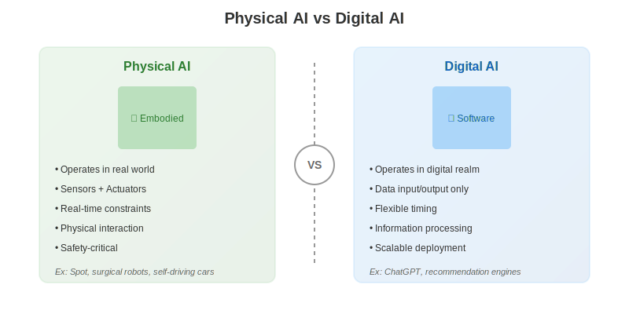
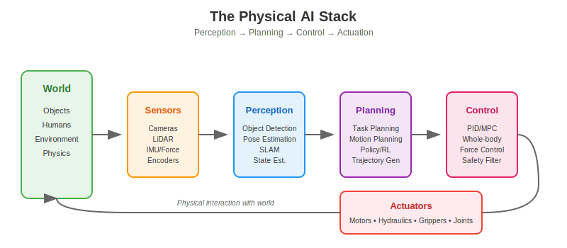

import { RAGZone } from '@site/src/components/extensibility/RAGZone';
import { Cite } from '@site/src/components/citations/Cite';

<RAGZone id="chapter1-theory">

## Defining Physical AI

**Physical AI** refers to artificial intelligence systems that are *embodied*—they have a physical presence in the world and can perceive, reason about, and act upon their environment <Cite id="ref1" />. Unlike software that runs entirely in the digital realm, Physical AI must contend with the messy, unpredictable realities of the physical world.

The concept of embodied intelligence has deep roots in AI research. Rodney Brooks famously argued that "intelligence without representation" requires physical grounding—that truly intelligent behavior emerges from direct interaction with the environment rather than abstract symbol manipulation <Cite id="ref2" />.

### Key Characteristics of Physical AI

Physical AI systems share several defining characteristics:

1. **Embodiment**: The system has a physical form that occupies space and interacts with objects
2. **Sensing**: Cameras, LiDAR, force sensors, and other hardware convert real-world phenomena into data
3. **Actuation**: Motors, hydraulics, and other mechanisms allow the system to exert forces and move
4. **Real-time Operation**: Decisions must be made fast enough to respond to a dynamic environment
5. **Safety Constraints**: Physical interaction with humans and objects demands careful safety considerations

## Physical AI vs Digital AI

To understand what makes Physical AI unique, it helps to contrast it with **Digital AI**—the type of AI most people interact with daily.

### Comparison Table

| Aspect | Physical AI | Digital AI |
|--------|------------|------------|
| **Domain** | Real world | Digital realm |
| **Input** | Sensors (cameras, LiDAR, IMU) | Text, images, structured data |
| **Output** | Physical actions (movement, grasping) | Text, decisions, recommendations |
| **Timing** | Real-time, safety-critical | Flexible, can retry |
| **Uncertainty** | High (sensor noise, dynamics) | Lower (clean data) |
| **Failure Mode** | Physical damage possible | Software errors |

### Concrete Examples

**Physical AI Systems:**
- **Boston Dynamics Spot**: A quadruped robot that navigates unstructured terrain, opens doors, and inspects industrial sites
- **Intuitive Surgical da Vinci**: A surgical robot that assists surgeons with precise, minimally invasive procedures
- **Waymo Self-Driving Vehicles**: Autonomous cars that perceive traffic, plan routes, and control steering/acceleration
- **Amazon Warehouse Robots**: Mobile platforms that transport inventory shelves to human workers

**Digital AI Systems:**
- **ChatGPT/Claude**: Large language models that generate text based on prompts
- **Netflix Recommendations**: Algorithms that suggest content based on viewing history
- **Google Search**: Systems that rank and retrieve relevant web pages
- **Fraud Detection**: Models that identify suspicious financial transactions

The key distinction: Digital AI processes information to produce information. Physical AI processes information to produce *action in the physical world*.

## The Physical AI Stack

Every Physical AI system—whether a humanoid robot, drone, or autonomous vehicle—implements some version of the **Physical AI stack**: a pipeline that transforms raw sensor data into coordinated physical action.

### Stack Components

#### 1. Sensors
The interface between the physical world and computation. Common sensors include:
- **Cameras**: RGB images, depth maps, stereo vision
- **LiDAR**: 3D point clouds of the environment
- **IMU**: Acceleration and angular velocity for state estimation
- **Force/Torque Sensors**: Contact forces for manipulation
- **Joint Encoders**: Motor positions and velocities

#### 2. Perception
Transforms raw sensor data into meaningful representations:
- **Object Detection**: Identifying and localizing objects in images or point clouds
- **Pose Estimation**: Determining the position and orientation of objects or the robot itself
- **SLAM**: Simultaneous Localization and Mapping—building maps while tracking position
- **State Estimation**: Fusing multiple sensors to estimate the robot's current state

#### 3. Planning
Decides what actions to take to achieve goals:
- **Task Planning**: High-level sequencing of subtasks (e.g., "pick up cup, move to table, place cup")
- **Motion Planning**: Finding collision-free paths through space
- **Policy Learning**: Using reinforcement learning to discover effective behaviors
- **Trajectory Generation**: Creating smooth, feasible motion profiles

#### 4. Control
Executes planned actions with precision and stability:
- **PID Control**: Classical feedback controllers for tracking references
- **Model Predictive Control (MPC)**: Optimization-based control over a prediction horizon
- **Whole-Body Control**: Coordinating all joints of a complex robot simultaneously
- **Safety Filtering**: Ensuring commands stay within safe operational bounds

#### 5. Actuators
Convert control signals into physical motion:
- **Electric Motors**: Most common, offering precise position and torque control
- **Hydraulics**: High power density for heavy-duty applications
- **Pneumatics**: Compliant actuation for soft robotics
- **Grippers/End Effectors**: Specialized tools for grasping and manipulation

### The Perception-Action Loop

What makes Physical AI fundamentally different from Digital AI is the **closed-loop** nature of the system. The robot acts on the world, which changes the sensor readings, which influences the next action. This continuous feedback loop operates at rates from 100Hz to 1000Hz, demanding efficient algorithms and robust implementations.

## Why Physical AI is Hard

Several factors make Physical AI significantly more challenging than pure software AI:

### 1. The Real World is Messy
Sensor readings are noisy, objects have complex shapes, lighting changes, and no two situations are exactly alike. Models trained in simulation often fail when deployed in reality—the famous **sim-to-real gap**.

### 2. Real-Time Constraints
A robot falling takes about 500 milliseconds. The control system must respond in single-digit milliseconds. There's no "loading screen" in robotics.

### 3. Safety is Non-Negotiable
A bug in a chatbot produces a wrong answer. A bug in a robot can cause physical harm. Safety must be designed into every layer of the system.

### 4. Hardware Limitations
Unlike software, you can't just "spin up more instances." Physical systems have mass, inertia, motor limits, and battery constraints that fundamentally bound what's achievable.

### 5. Long-Tail Scenarios
Autonomous vehicles must handle not just normal driving, but also construction zones, emergency vehicles, animals on the road, and countless other rare situations. Achieving 99% performance is easy; achieving 99.999% is enormously difficult.

## The Promise of Physical AI

Despite these challenges, Physical AI represents one of the most exciting frontiers in technology. Embodied AI systems promise to:

- **Extend human capability** in dangerous, dirty, or dull tasks
- **Provide care** for aging populations through assistive robots
- **Transform manufacturing** with flexible, adaptable automation
- **Explore environments** too hazardous for humans, from deep ocean to distant planets
- **Democratize physical labor** by making robotic assistance widely accessible

The humanoid form factor, which we'll explore in the next section, represents a particularly compelling approach to achieving this vision.

</RAGZone>
