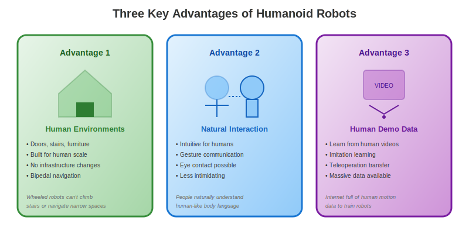
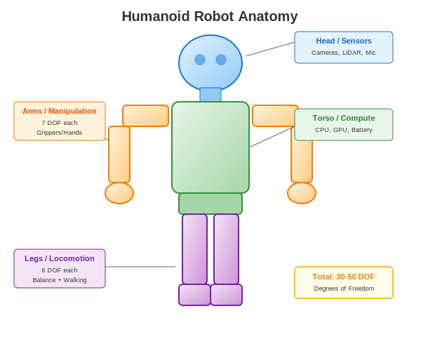

import { RAGZone } from '@site/src/components/extensibility/RAGZone';
import { Cite } from '@site/src/components/citations/Cite';

<RAGZone id="chapter1-humanoids">

## The Case for Humanoid Robots

Among all possible robot designs—wheeled platforms, quadrupeds, industrial arms, drones—why focus on **humanoid robots**? The humanoid form factor, despite its complexity, offers unique advantages that make it particularly compelling for general-purpose robotics <Cite id="ref3" />.

This isn't about making robots look human for aesthetic reasons. It's about practical engineering considerations that make humanoid robots especially well-suited for operating in human environments and alongside human workers.

## Three Key Advantages

### Advantage 1: Designed for Human Environments

Our world is built for humans. Doorways are human-width. Stairs have human-sized steps. Tools have human-scale handles. Furniture is arranged for human navigation.

A humanoid robot can operate in these spaces **without any infrastructure modifications**:

- **Stairs and ladders**: Bipedal locomotion enables navigation of vertical terrain
- **Narrow passages**: Human-width body fits through doorways and aisles
- **Furniture and obstacles**: Arm reach matches human workspace assumptions
- **Vehicle cabins**: Can enter and operate human vehicles (cars, forklifts, aircraft)

In contrast, wheeled robots require ramps, elevators, and cleared floors. Quadrupeds can handle stairs but struggle with ladders and confined spaces. Industrial arms are fixed in place. Only humanoids offer the full mobility range that human environments assume.

**Real-world example**: When DARPA held the Robotics Challenge after the Fukushima nuclear disaster, the most challenging tasks—driving vehicles, opening doors, climbing ladders, operating valves—all required human-like manipulation and locomotion capabilities.

### Advantage 2: Natural Human-Robot Interaction

Humans have spent millions of years evolving to understand human body language, gestures, and movement. A humanoid robot can leverage this innate understanding <Cite id="ref4" />.

**Communication advantages**:
- **Gesture recognition goes both ways**: Humans naturally understand pointing, waving, nodding
- **Gaze direction**: Eye contact conveys attention and intent
- **Posture and body language**: Conveys approachability, alertness, uncertainty
- **Personal space**: Human-like proportions enable intuitive proxemics

**Psychological benefits**:
- **Less intimidating**: Familiar form reduces fear and uncertainty
- **Predictable motion**: Humans can anticipate humanoid movements
- **Empathy response**: People naturally attribute intentions to human-like forms
- **Collaboration**: Side-by-side work feels more natural

Studies in human-robot interaction consistently show that people find humanoid robots easier to work with compared to non-anthropomorphic designs—even when the underlying capabilities are similar.

### Advantage 3: Leveraging Human Demonstration Data

This advantage has become increasingly important with the rise of machine learning in robotics.

**The data advantage**:
- **Billions of hours** of human motion video exist online
- **YouTube, TikTok, movies**: Cooking, cleaning, manufacturing, sports—all documented
- **Teleoperation transfer**: A human operator can directly demonstrate tasks
- **Motion capture datasets**: Decades of human movement data from animation and sports science

For a humanoid robot with similar kinematics to humans, this data is directly applicable:
- **Imitation learning**: Watch a human, replicate the motion
- **Behavior cloning**: Teleoperate a task, then let the robot practice autonomously
- **Cross-embodiment transfer**: Skills learned on one humanoid can transfer to another

Non-humanoid robots face a **correspondence problem**: How do you translate human arm movements to a robot with different joint configurations? Humanoids largely sidestep this issue because their bodies are designed to move like human bodies.

## Humanoid Anatomy Overview

Let's examine the major subsystems of a typical humanoid robot:

### Head and Sensors

The head typically houses the primary perception systems:
- **Cameras**: Stereo vision for depth perception, often with wide-angle and zoom capabilities
- **LiDAR**: 3D scanning for mapping and obstacle detection
- **Microphones**: Audio input for voice commands and sound localization
- **IMU**: Inertial measurement for head stabilization and gaze control

The head's mobility (typically 2-3 degrees of freedom for pan and tilt) enables active perception—directing sensors toward areas of interest.

### Torso and Compute

The torso serves as the robot's central hub:
- **Compute hardware**: CPUs, GPUs, neural accelerators for perception and planning
- **Battery system**: Power storage (often lithium-ion) for untethered operation
- **Power distribution**: Voltage regulation and motor drivers
- **Communication**: WiFi, cellular, or Ethernet connectivity
- **Structural backbone**: Supports arm and head loads while enabling torso rotation

Modern humanoids typically have 1-3 degrees of freedom in the torso for waist rotation and bending.

### Arms and Manipulation

Each arm typically provides 7 degrees of freedom (DOF)—mimicking human arm kinematics:
- **Shoulder**: 3 DOF (flexion/extension, abduction/adduction, rotation)
- **Elbow**: 1 DOF (flexion/extension)
- **Wrist**: 3 DOF (flexion/extension, ulnar/radial deviation, pronation/supination)

**End effectors** vary by application:
- **Anthropomorphic hands**: 5-fingered designs with 15-20+ DOF for dexterous manipulation
- **Parallel-jaw grippers**: Simple but effective for many grasping tasks
- **Tool changers**: Allow swapping between specialized tools

The 7-DOF configuration is significant: it provides **kinematic redundancy**, meaning there are multiple arm configurations that achieve the same hand position. This enables obstacle avoidance and optimization for other objectives.

### Legs and Locomotion

Bipedal legs are perhaps the most challenging subsystem. Each leg typically has 6 DOF:
- **Hip**: 3 DOF (flexion/extension, abduction/adduction, rotation)
- **Knee**: 1 DOF (flexion/extension)
- **Ankle**: 2 DOF (dorsiflexion/plantarflexion, inversion/eversion)

**Key challenges**:
- **Balance**: Unlike wheeled robots, bipeds are inherently unstable
- **Foot placement**: Discrete contact points require careful planning
- **Impact forces**: Walking generates significant forces at heel strike
- **Energy efficiency**: Human walking is remarkably efficient; robots struggle to match it

Modern humanoids achieve walking speeds of 1-3 m/s and can handle moderate terrain variations. Research continues on running, jumping, and highly dynamic maneuvers.

## The Humanoid Renaissance

We're currently experiencing a **humanoid robot renaissance**. Several factors have converged:

1. **Compute advances**: GPUs and neural accelerators enable real-time perception and control
2. **Machine learning**: Deep learning has transformed robot capabilities
3. **Simulation**: High-fidelity physics engines enable massive parallel training
4. **Actuator technology**: Electric motors have improved in power density
5. **Investment**: Billions of dollars flowing into humanoid robotics companies

Notable examples include:
- **Boston Dynamics Atlas**: Highly athletic demonstrations of parkour and manipulation
- **Tesla Optimus**: Consumer-focused humanoid targeting home assistance
- **Figure 01/02**: Humanoids designed for warehouse and manufacturing work
- **Agility Digit**: Bipedal robot deployed in real logistics facilities
- **Sanctuary AI Phoenix**: Focus on dexterous manipulation
- **1X EVE/NEO**: Humanoids for home and commercial applications

The next decade will likely see humanoid robots transition from research laboratories to practical deployment—and understanding their capabilities and limitations is essential for anyone working in this field.

</RAGZone>
