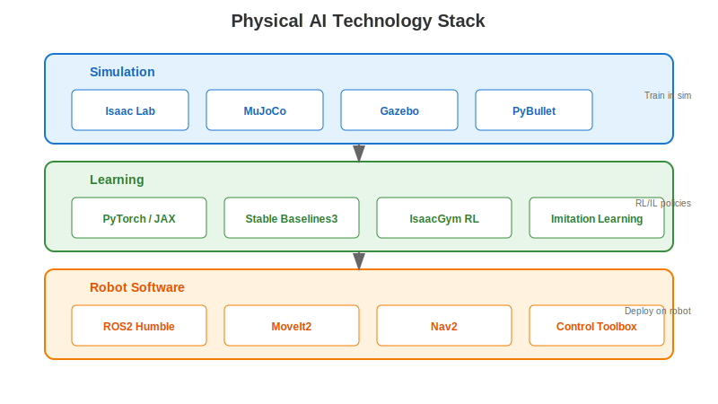
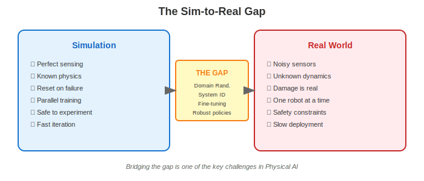

import { RAGZone } from '@site/src/components/extensibility/RAGZone';
import { Cite } from '@site/src/components/citations/Cite';

<RAGZone id="chapter1-tech">

## The Physical AI Technology Stack

Building humanoid robots that can perceive, reason, and act requires a sophisticated stack of tools—from simulators where we train policies to frameworks that deploy them on real hardware. This section provides a high-level overview of the technologies you'll encounter throughout this textbook.

## Simulation Tools

Simulation is the foundation of modern robot learning. Training a robot in the real world is slow, expensive, and potentially dangerous. Simulators allow us to collect millions of experiences in hours, fail safely, and iterate rapidly.

### NVIDIA Isaac Lab

Isaac Lab (formerly Isaac Gym) is NVIDIA's high-performance simulation platform built on their Omniverse engine <Cite id="ref5" />.

**Key features**:
- **GPU-accelerated physics**: Run thousands of robot instances in parallel
- **Reinforcement learning integration**: Direct tensor output for ML frameworks
- **Photorealistic rendering**: Domain randomization with realistic visuals
- **USD asset format**: Industry-standard 3D asset pipeline

Isaac Lab excels at training locomotion and manipulation policies at scale. You'll use it extensively in Chapters 4 and 5.

### MuJoCo

MuJoCo (Multi-Joint dynamics with Contact) was developed by Emo Todorov and is now open-sourced by DeepMind <Cite id="ref6" />.

**Key features**:
- **Fast and accurate**: Efficient contact dynamics simulation
- **Research-friendly**: Default simulator for many RL benchmarks
- **Python bindings**: Easy integration with PyTorch and JAX
- **Muscle models**: Supports musculoskeletal simulation

MuJoCo is particularly popular for research on contact-rich manipulation and legged locomotion.

### Gazebo

Gazebo is the standard simulator in the ROS ecosystem <Cite id="ref7" />.

**Key features**:
- **ROS integration**: Native support for ROS topics and services
- **Physics engines**: Supports ODE, Bullet, DART, Simbody
- **Sensor models**: Cameras, LiDAR, IMU, GPS simulation
- **Community**: Large library of robot models and environments

Gazebo is essential for testing ROS-based robot software before hardware deployment.

## Learning Frameworks

### PyTorch and JAX

Modern robot learning relies heavily on deep learning frameworks:

- **PyTorch**: The dominant framework for robotics research, offering flexibility and extensive community support
- **JAX**: Google's framework gaining traction for its functional programming style and excellent JIT compilation

### Reinforcement Learning Libraries

Several libraries simplify implementing RL algorithms:

- **Stable Baselines3**: Well-documented implementations of PPO, SAC, TD3
- **rl_games**: High-performance implementations optimized for GPU simulation
- **RSL_RL**: ETH Zurich's library, particularly strong for locomotion

### Imitation Learning

Beyond RL, imitation learning approaches are increasingly important:

- **Behavior cloning**: Direct supervised learning from demonstrations
- **GAIL/AIRL**: Adversarial imitation learning
- **Diffusion policies**: Generative models for action prediction

## Robot Software Stack

### ROS2

ROS2 (Robot Operating System 2) is the middleware that connects robot components <Cite id="ref7" />.

**Core concepts**:
- **Nodes**: Independent processes that perform computation
- **Topics**: Publish-subscribe message passing
- **Services**: Request-response communication
- **Actions**: Long-running tasks with feedback

ROS2 provides:
- **Real-time support**: Improved determinism over ROS1
- **DDS communication**: Industry-standard middleware
- **Lifecycle management**: Node state machines
- **Security**: Built-in authentication and encryption

### MoveIt2

MoveIt2 is the motion planning framework for manipulation:

- **Motion planning**: OMPL integration for collision-free paths
- **Kinematics**: Forward and inverse kinematics solvers
- **Collision checking**: Fast geometric collision detection
- **Trajectory execution**: Interface to robot controllers

### Nav2

Nav2 handles mobile robot navigation:

- **Path planning**: Global and local planners
- **Localization**: AMCL and other localization methods
- **Behavior trees**: Flexible navigation behaviors
- **Recovery behaviors**: Handling stuck situations

## The Sim-to-Real Gap

One of the central challenges in Physical AI is transferring policies trained in simulation to real robots. This **sim-to-real gap** arises from:

- **Physics modeling errors**: Real friction, damping, and contact differ from simulation
- **Sensor differences**: Simulated sensors are often idealized
- **Latency and delays**: Real systems have communication and actuation delays
- **Environmental variation**: The real world has infinite complexity

### Bridging Strategies

Several techniques help bridge this gap:

1. **Domain Randomization**: Vary simulation parameters (friction, masses, colors) to train robust policies
2. **System Identification**: Measure real robot parameters and match them in simulation
3. **Fine-tuning**: Limited real-world training to adapt sim-trained policies
4. **Sim-to-sim transfer**: Train on multiple simulators to find invariant features

Chapter 10 covers sim-to-real transfer in detail.

## Hardware Platforms

This textbook references several hardware platforms:

### Humanoid Platforms
- **Unitree H1/G1**: Affordable research humanoids with good documentation
- **Boston Dynamics Atlas**: State-of-the-art humanoid (limited availability)
- **Figure 01/02**: Commercial humanoids in early deployment

### Quadruped Platforms
- **Unitree Go1/Go2**: Accessible quadrupeds for locomotion research
- **Boston Dynamics Spot**: Industrial quadruped with extensive APIs
- **Anymal**: Swiss-made quadruped for research

### Manipulation Platforms
- **Franka Panda**: 7-DOF arm popular in manipulation research
- **UR5/UR10**: Collaborative arms with ROS support
- **Kinova Gen3**: Lightweight arm with integrated gripper

You don't need physical hardware to learn from this textbook—all concepts can be explored in simulation.

</RAGZone>
