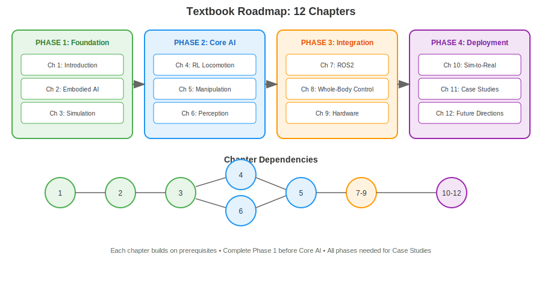
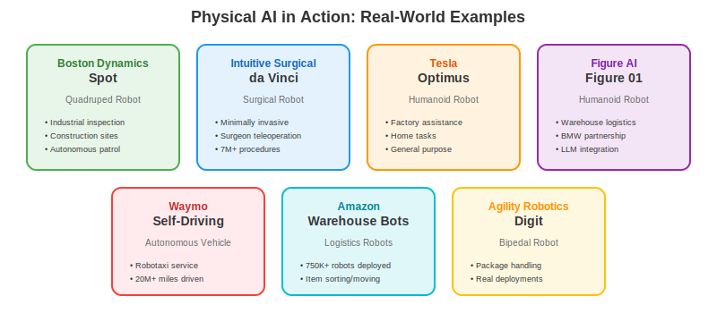

## Navigating This Textbook

This textbook is organized into **12 chapters** across **4 phases**, progressively building from foundational concepts to real-world deployment. This section helps you understand the structure and plan your learning path.



## The Four Phases

### Phase 1: Foundation (Chapters 1-3)

**Where you are now.** This phase establishes the conceptual and technical foundation:

| Chapter | Focus | Key Outcomes |
|---------|-------|--------------|
| **Ch 1: Introduction** | Physical AI concepts, humanoid motivation | Define Physical AI, explain humanoid advantages |
| **Ch 2: Embodied AI** | Kinematics, coordinate frames, perception basics | Model robot bodies mathematically |
| **Ch 3: Simulation** | Isaac Lab, MuJoCo, simulation workflows | Train first policies in simulation |

**By completing Phase 1**, you'll understand what Physical AI is, how robots are represented mathematically, and how to train basic policies in simulation.

### Phase 2: Core AI (Chapters 4-6)

This phase covers the AI techniques that enable robot capabilities:

| Chapter | Focus | Key Outcomes |
|---------|-------|--------------|
| **Ch 4: RL Locomotion** | PPO, SAC, reward shaping for walking | Train bipedal walking policies |
| **Ch 5: Manipulation** | Grasping, DexNet, dexterous hands | Train manipulation policies |
| **Ch 6: Perception** | Computer vision, proprioception, state estimation | Process sensor data for control |

**By completing Phase 2**, you'll be able to train robots to walk, grasp objects, and perceive their environment.

### Phase 3: Systems Integration (Chapters 7-9)

This phase bridges simulation and real robots:

| Chapter | Focus | Key Outcomes |
|---------|-------|--------------|
| **Ch 7: ROS2** | Robot middleware, topics, services, actions | Build ROS2-based robot software |
| **Ch 8: Whole-Body Control** | QP/MPC, coordinated motion | Control full humanoid bodies |
| **Ch 9: Hardware** | Actuators, sensors, embedded systems | Understand robot hardware |

**By completing Phase 3**, you'll know how to build complete robot software systems and interface with hardware.

### Phase 4: Deployment & Future (Chapters 10-12)

The final phase covers real-world deployment and emerging trends:

| Chapter | Focus | Key Outcomes |
|---------|-------|--------------|
| **Ch 10: Sim-to-Real** | Domain randomization, transfer learning | Deploy simulation policies on robots |
| **Ch 11: Case Studies** | Figure, Apollo, Optimus, real deployments | Analyze real humanoid systems |
| **Ch 12: Future Directions** | Foundation models, AGI, societal impact | Understand emerging trends |

**By completing Phase 4**, you'll understand how to deploy robot systems and where the field is heading.

## Chapter Dependencies

Not all chapters must be completed sequentially. Here's the dependency structure:

```
Ch 1 → Ch 2 → Ch 3 ──┬─→ Ch 4 → Ch 5 ──┬─→ Ch 7 → Ch 8 → Ch 9 → Ch 10
                     │                  │
                     └─→ Ch 6 ──────────┘

Ch 11 and Ch 12 require all preceding chapters
```

**Key dependencies**:
- Chapters 1-3 are strictly sequential (each builds on the previous)
- Chapter 4 (locomotion) and Chapter 6 (perception) can be done in parallel after Ch 3
- Chapter 5 (manipulation) requires Chapter 4
- Chapters 7-10 are sequential
- Chapters 11-12 synthesize all prior material

## Learning Paths

Depending on your interests, you might prioritize different paths:

### 🚶 Locomotion Focus
If you're most interested in making robots walk and run:
1. Complete Phase 1 thoroughly
2. Focus on Chapter 4 (RL Locomotion) and Chapter 8 (Whole-Body Control)
3. Skim manipulation content
4. Deep dive into Chapter 10 (Sim-to-Real)

### 🤖 Manipulation Focus
If you're most interested in robot arms and grasping:
1. Complete Phase 1 thoroughly
2. Focus on Chapter 5 (Manipulation) and Chapter 6 (Perception)
3. Skim locomotion content
4. Chapter 7 (ROS2) is essential for manipulation systems

### 🧠 AI/ML Focus
If you're primarily interested in the learning algorithms:
1. Complete Phase 1 thoroughly
2. Deep dive into Chapters 4-6 (all the learning)
3. Chapter 10 (Sim-to-Real) is crucial for understanding deployment challenges
4. Hardware chapters can be lighter

### 🔧 Systems/Integration Focus
If you're interested in building complete robot systems:
1. Complete Phases 1-2 at a survey level
2. Deep dive into Chapters 7-9 (ROS2, control, hardware)
3. Chapter 10 and 11 for practical deployment

## Prerequisites Review

Each chapter lists specific prerequisites. For this entire textbook, you need:

**Required**:
- Basic programming (Python preferred)
- Linear algebra (vectors, matrices, transformations)
- Basic calculus (derivatives, gradients)
- Probability basics (distributions, expectations)

**Helpful but not required**:
- Machine learning fundamentals
- Control systems basics
- Computer vision familiarity
- ROS1 experience

**Don't have these yet?** See the prerequisite links in Chapter 1's introduction for recommended resources.

## How to Use This Textbook

### Active Learning
Each chapter includes:
- **Simulation exercises**: Hands-on code in Google Colab or Isaac Lab
- **Concept checks**: Quick self-assessment questions
- **End-of-chapter quiz**: Validates learning objectives

Don't just read—work through the exercises. Physical AI is a hands-on field.

### Lab Access
For simulation exercises, you'll need:
- **Google Colab**: Free, browser-based, sufficient for many exercises
- **Local setup**: For Isaac Lab exercises, a Linux machine with NVIDIA GPU is ideal
- **Cloud options**: AWS/GCP instances work for heavy simulation

No physical robot required—everything can be learned in simulation.

### Community Resources
- **GitHub**: All code examples available in the textbook repository
- **Discord**: Discussion forum for questions and collaboration
- **Office Hours**: Live Q&A sessions (schedule in repository)

## What's Next

You've completed Chapter 1! You now understand:
- ✅ What Physical AI is and how it differs from Digital AI
- ✅ Why humanoid robots are a compelling form factor
- ✅ The technology stack you'll use throughout this textbook
- ✅ How to navigate the chapters based on your interests

**Next up**: Chapter 2: Embodied AI dives into the mathematical foundations—coordinate frames, kinematics, and how we model robot bodies. *(Coming soon)*


